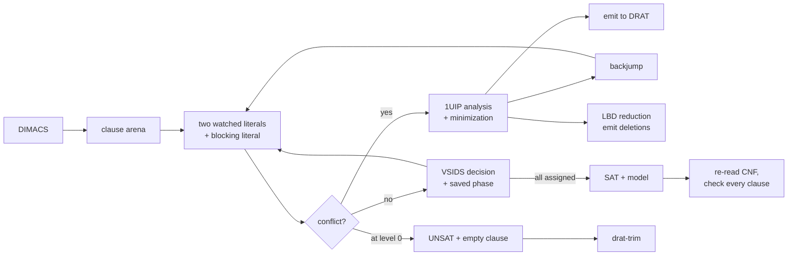

# cdcl-sat

A CDCL SAT solver in dependency-free C++17 that emits DRAT proofs, so its
unsatisfiable answers are checked by somebody else's program.

[](https://github.com/asp53826/cdcl-sat/actions/workflows/ci.yml)


> "Satisfiable" comes with an assignment anyone can check in linear time.
> "Unsatisfiable" comes with nothing at all, unless the solver writes down its
> reasoning. So it writes it down.

## What is actually implemented

- two-watched-literal propagation with blocking literals over an arena-allocated
  clause database;
- first-UIP conflict analysis with recursive clause minimization;
- VSIDS branching on a binary heap, with phase saving;
- Luby restarts;
- LBD-scored clause database reduction that never drops a locked or glue clause;
- root-level simplification;
- DRAT proof emission, including deletion lines;
- a DIMACS reader that treats the header as a hint rather than as truth.

## Measured, not implied

Apple M2 Pro, macOS, Apple Clang 17. Every number below is produced by a script
in this repository.

| Check | Result |
|---|---:|
| Random 3-SAT instances solved, ratio 3.6–5.2 | **300** |
| Unsatisfiable answers **verified by drat-trim** | **180 / 180** |
| Satisfiable answers verified against the source CNF | **120 / 120** |
| Verdicts agreeing with CaDiCaL 3.0.1 | **300 / 300** |
| DRAT proof lines emitted and checked | 108,206 |
| Unit-test assertions | **1,943 passed** |
| Configurations cross-checked for identical answers | 5 × 400 instances |

The verification row is the one that matters. `drat-trim` is Marijn Heule's
checker, fetched at build time rather than vendored so that it is unambiguously
not my code doing the verifying. It replays every learned clause, confirms each
follows from the ones above it by reverse unit propagation, and confirms the
last one is empty. It either prints `s VERIFIED` or it does not.

```
c 133 of 133 clauses in core
c 824 of 859 lemmas in core using 10805 resolution steps
s VERIFIED
```

## Verify it

```bash
make test
```

```bash
make drat-trim && make proof-test PROOF_COUNT=300 PROOF_VARS=120
```

Those are the parameters that produce the table above; bare `make proof-test`
runs 60 instances at 90 variables and prints smaller numbers.

```bash
make ablation                                    # 150 vars, 40 instances
python3 bench/ablation.py --solver ./build/satsolve --instances 25 --vars 200
```

The second invocation is the one that reproduces the table below; `make
ablation` uses smaller defaults and prints different numbers.

```bash
CADICAL=/path/to/cadical make benchmark
```

[`claims.toml`](claims.toml) binds twelve of the numbers above to the commands
that produce them, and Claim Auditor re-runs those commands weekly. Every one is
audited at zero tolerance: the instance set is seeded and the ablation measures
conflicts rather than seconds, so the counts are identical across compilers and
machines. The timing columns are excluded, and the manifest says why.

`proof-test` generates instances straddling the phase transition, solves them,
model-checks every SAT answer against the file it came from, and hands every
UNSAT answer to drat-trim. It exits non-zero if anything is rejected.

## What each part of CDCL is worth

A comparison against a state-of-the-art solver tells you that you are slower. It
does not tell you which ideas are carrying the result. So: the same instances,
one component disabled at a time.

Random 3-SAT, 200 variables, ratio 4.26, 25 instances:

| configuration | conflicts | seconds | vs full |
|---|---:|---:|---:|
| full | 381,410 | 3.07 | 1.00x |
| no VSIDS decay (`--var-decay 1.0`) | 799,322 | 5.94 | **1.94x** |
| restart every 20 conflicts | 497,379 | 4.45 | 1.45x |
| no phase saving | 403,780 | 3.73 | 1.22x |
| no clause minimization | 453,771 | 3.70 | 1.20x |
| restart every 50,000 conflicts | 379,551 | 3.05 | **1.00x** |

All six configurations solved all 25 instances and agree on every answer.

VSIDS is the component doing the work: freezing the decay doubles both the
conflict count and the runtime. Everything else is worth 20–45%.

The last row is the one I did not expect and am not going to bury. Restarting
essentially never is *indistinguishable* from Luby restarts at this instance
size — 379,551 conflicts against 381,410. Restarting too often clearly hurts,
so the restart machinery is not free, but the case for having it is not visible
in these numbers. It would take larger instances, or families with heavy-tailed
runtimes, to show what Luby is actually for. Reporting a 1.00x on my own feature
is more useful than picking an instance size where it wins.

Conflicts is the search-quality metric; seconds is the throughput metric. They
are reported separately because a configuration can win on one and lose on the
other, and collapsing them into a single "speedup" hides exactly that.

## Distance to a real solver

Random 3-SAT at the phase transition, 5 instances per size, 45s timeout,
against CaDiCaL 3.0.1. Timings exclude proof emission.

| vars | solved | mine (s) | conflicts | CaDiCaL (s) | ratio |
|---:|---:|---:|---:|---:|---:|
| 100 | 5/5 | 0.02 | 1,761 | 0.04 | **0.6x** |
| 150 | 5/5 | 0.07 | 11,614 | 0.16 | **0.5x** |
| 200 | 5/5 | 0.52 | 72,004 | 0.92 | **0.6x** |
| 250 | 5/5 | 10.67 | 776,308 | 12.90 | **0.8x** |
| 300 | 5/5 | 77.00 | 3,284,501 | 28.76 | 2.7x |

I did not expect to win any of these rows. Up to 250 variables this solver is
faster than CaDiCaL, and the reason is not that it is better: it is that
CaDiCaL's inprocessing does work up front that does not pay for itself on
instances this small. Reporting it as a win would be misreading my own
benchmark.

At 300 variables the picture inverts and CaDiCaL is 2.7x ahead while my conflict
count has gone up 4.2x. The crossover is the actual finding, and it locates the
gap precisely: it is not constant factors in the propagation loop, it is that
CaDiCaL is simplifying the formula as it goes and this solver is not.

**Pigeonhole PHP(n)** — n+1 pigeons into n holes, unsatisfiable:

| holes | vars | clauses | mine (s) | conflicts | CaDiCaL (s) |
|---:|---:|---:|---:|---:|---:|
| 6 | 42 | 133 | 0.01 | 858 | 0.01 |
| 7 | 56 | 204 | 0.04 | 5,605 | 0.03 |
| 8 | 72 | 297 | 0.25 | 23,171 | 0.30 |
| 9 | 90 | 415 | 3.33 | 156,258 | 3.28 |
| 10 | 110 | 561 | **timeout** | — | **timeout** |

Both solvers track each other almost exactly, and both fall off the same cliff
at n=10 on a formula with 110 variables. That is not an implementation result,
it is Haken's theorem showing up in a table: every resolution refutation of
PHP(n) is exponentially long, and CDCL learns by resolution. Twenty years of
engineering buys nothing here, which is the most useful thing in this README.

## Where it loses

**Pigeonhole, unconditionally.** PHP(n) has no polynomial-length resolution
proof — Haken, 1985 — and CDCL learns clauses by resolution. No amount of
engineering fixes this family; CaDiCaL is faster here and also loses. It is in
the benchmark because a benchmark set the approach always wins on is not
measuring the approach.

**The gap to CaDiCaL is a cliff, not a slope.** Even at 250 variables, then
2.7x behind at 300. Nothing about the inner loop changed between those two rows;
what changed is that the instances got big enough for formula simplification to
matter. Variable elimination, subsumption, vivification and probing are all
absent here, and they are most of what separates a solver you can explain from
one you can compete with.

**Proofs are large and unbounded.** 108,206 lines for 180 small refutations.
On hard instances DRAT files reach hundreds of megabytes and checking can cost
more than solving. The proof is written straight through with a 64 KiB buffer
and no attempt at compression; binary DRAT and LRAT both exist and neither is
implemented.

**Emitting proofs is not free.** Every learned clause is written, including the
ones that are deleted twenty conflicts later. Instances where the solver learns
faster than the disk absorbs will be I/O bound, and the benchmark numbers above
are all measured *without* `--proof` for that reason — which is itself worth
stating rather than quietly doing.

**No incremental interface.** No assumptions, no IPASIR, no re-solve. Every call
starts from scratch, which rules out the use case that most applications of SAT
actually have.

**Verified UNSAT, asserted UNKNOWN.** With `--budget` the solver can return
UNKNOWN, and an UNKNOWN carries no evidence of anything. That is honest but it
is not a result.

## How a run works



## Why position 0 matters

The one invariant in the propagation loop that is easy to break and hard to
notice: when a clause propagates, the implied literal is left at index 0.

`analyze()` walks reason clauses starting from index 1, assuming index 0 holds
the literal that clause implied. Break it and conflict analysis resolves on the
wrong literal, producing learned clauses that do not follow from the formula.
The solver still terminates. It still answers. The answers are wrong.

This is a good advertisement for proof emission: a unit test suite can miss it
for a long time, and drat-trim rejects the very first affected refutation.

## Repository map

```text
include/sat/solver.h      public API, options, statistics
include/sat/proof.h       DRAT emission
include/sat/dimacs.h      reader and independent model checker
src/solver.cpp            arena, watch lists, 1UIP, VSIDS, restarts, reduction
src/proof.cpp             buffered DRAT writer
src/dimacs.cpp            hand-rolled parser, model verification
src/main.cpp              CLI, competition exit codes
tests/test_sat.cpp        unit and differential tests
scripts/gen_cnf.py        random 3-SAT, pigeonhole, parity chains
scripts/check_proofs.py   the verification campaign
bench/ablation.py         component-by-component measurement
bench/benchmark.py        scaling, and the pigeonhole wall
```

## What would come next

- bounded variable elimination and subsumption, which is where most of the
  remaining gap is;
- vivification of learned clauses;
- binary DRAT, and LRAT so the checker does not have to search;
- an incremental interface with assumptions;
- chronological backtracking and target phases.

Each is a specific measured gap rather than a feature list.

## License

MIT. `drat-trim` is fetched from its upstream repository at build time and is
not included here.
